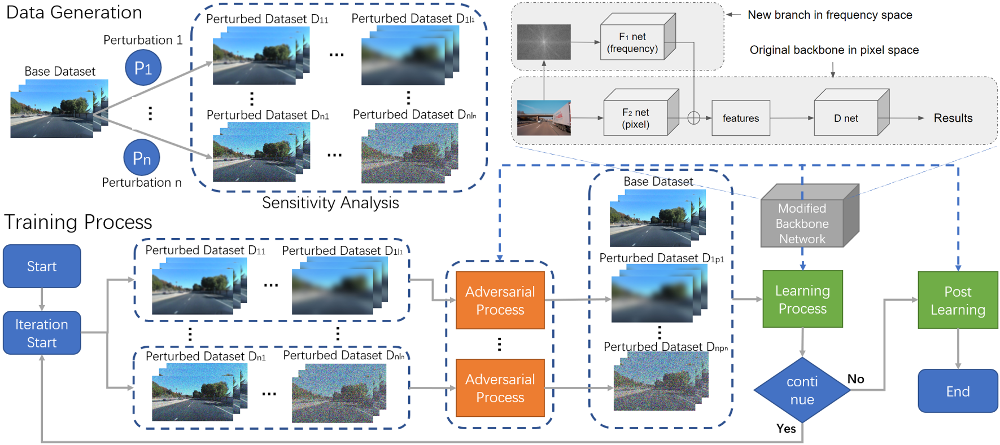
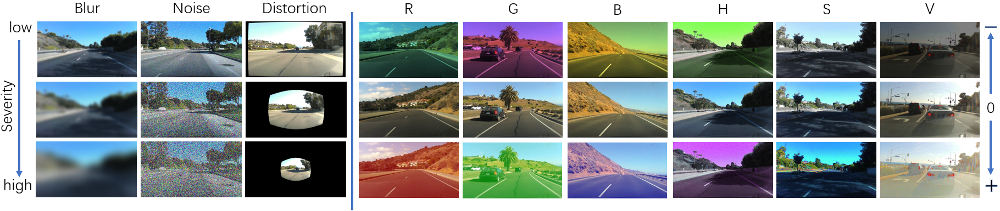
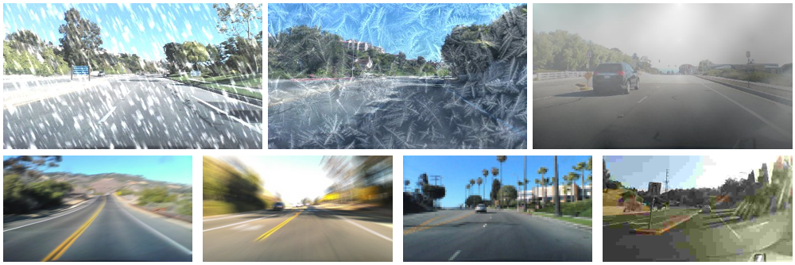

# Gradient-Free Adversarial Training Against Image Corruption for Learning-based Steering
### [Project](https://gamma.umd.edu/researchdirections/autonomousdriving/visionrobustlearning/) | [Video](http://www.cs.umd.edu/~yushen/videos/NIPS2021.mp4) | [Paper](http://www.cs.umd.edu/~yushen/docs/NIPS2021.pdf) <br>
We introduce a simple yet effective framework for improving the robustness of learning algorithm against (input) image corruptions for autonomous driving, due to both internal (e.g., sensor noises and hardware abnormalities) and external factors (e.g., lighting, weather, visibility, and other environmental effects). <br><br>
[Gradient-Free Adversarial Training Against Image Corruption for Learning-based Steering (NIPS 2021)](https://gamma.umd.edu/researchdirections/autonomousdriving/visionrobustlearning/)  
[Yu Shen](http://cs.umd.edu/~yushen), [Laura Zheng](https://laurayuzheng.github.io/), [Manli Shu](https://www.cs.umd.edu/people/manlis), [Weizi Li](https://www.memphis.edu/cs/people/faculty_pages/weizi-li.php), [Tom Goldstein](https://www.cs.umd.edu/~tomg/), [Ming C. Lin](http://cs.umd.edu/~lin).
University of Maryland, College Park
 

- Our results
<p align='center'>
  
  
  
</p>

## Prerequisites
- Linux
- Python 2 or 3
- NVIDIA GPU + CUDA cuDNN


## Getting Started
### Installation
See working_env.txt

### Dataset
- We publish a steering dataset [here](https://drive.google.com/file/d/1ZBqYlGToGPpVPZlr38VCTLrPt_XF6P-q/view?usp=sharing) (2.75G, low resolution version).

Label Format:
Each row contains "[image file name],,,[turning angle]"

The raw dataset we used came from multiple sources, and some of them are public available:
- Audi Dataset: [here](https://www.a2d2.audi/a2d2/en.html)
- Honda Dataset: [here](https://usa.honda-ri.com/hdd)
- Waymo Dataset: [here](https://waymo.com/open/)
- SullyChen Driving Dataset: [here](https://github.com/SullyChen/driving-datasets)


### Data Preparation
#### Ganerate training perturbation (single perturbations, R, G, B, H, S, V, blur, noise, distortion)
```bash
python library/regenerate_dataset.py --generation_mode=train --src_folder=./Data/trainA
```

#### Ganerate test perturbation (single perturbation, combined perturbation, unseen perturbation)
```bash
python library/regenerate_dataset.py --generation_mode=test --src_folder=./Data/testA
```

#### Train Model
Train the model with different methods:

```bash
python batch_train_test.py --run_mode=train_base --dataset_root=./Data/
python batch_train_test.py --run_mode=train_maxup --dataset_root=./Data/
python batch_train_test.py --run_mode=train_ours --dataset_root=./Data/
```

For AugMix

```bash

python augmix/steering.py --gpu_id=0 --num-workers=8 --epochs=1000 --save=./Data/augmix ./Data/trainB/ ./Data/labelsB_train.csv
```


### Test Model


## Citation

If you find this useful for your research, please use the following.

```
@inproceedings{shen2021robustness,
  title={Gradient-Free Adversarial Training Against Image Corruption for Learning-based Steering},
  author={Yu Shen and Laura Zheng and Manli Shu and Weizi Li and Tom Goldstein and Ming C. Lin},  
  booktitle={Neural Information Processing Systems (NIPS)},
  year={2021}
}
```

## Acknowledgments
We would like to thank the Army Research Office, National Science Foundation, Elizabeth Iribe Professorship, Barry Mersky Professorship, and Capital One Professorship.

We modified the augmix code for our steering task based on [augmix](https://github.com/google-research/augmix).